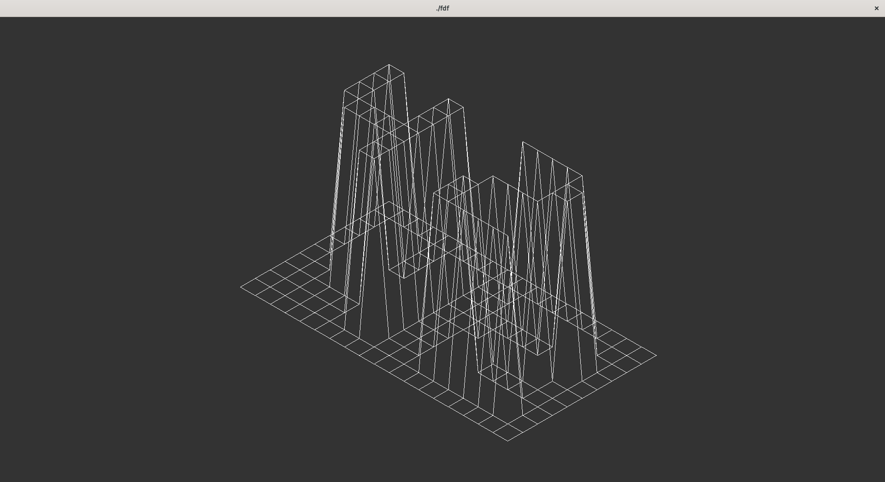

# FDF



## Overview

FDF brings your map data to life. Visualize terrain, landscapes, or abstract structures in a dynamic 3D wireframe
environment with interactive controls.

**Disclaimer**: This project serves as a learning example and does not strictly adhere to common core conventions or
specific coding norms.

## Prerequisites

- [MLX42](https://github.com/codam-coding-college/MLX42) (included as a submodule; ensure its dependencies like GLFW are
  installed for compilation) -
- get_next_line (included as a submodule)

## Instructions:

1. **Compile**: Use the `make` command to compile the project.
3. **Run**: Execute the `fdf` program with a `map file` as the argument.

Example:

```bash
./fdf maps/42.fdf
```

**Controls**

* **Move**: Hold the left mouse button and drag.
* **Zoom**: Use the mouse scroll wheel.
* **Resize**: Drag the window edges or maximize to fit your screen.
